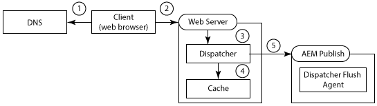
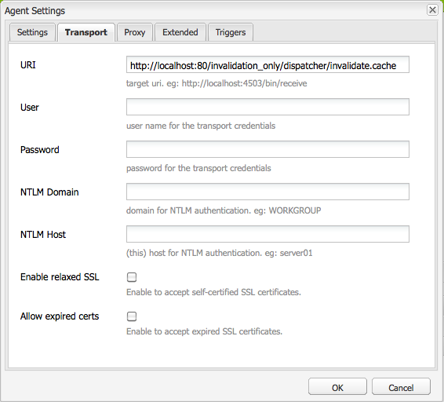
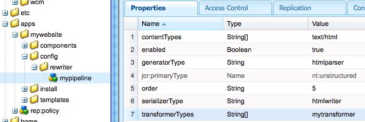

# Dispatcher gebruiken met meerdere domeinen {#using-dispatcher-with-multiple-domains}

>[!NOTE]
>
>Dispatcher-versies zijn onafhankelijk van AEM. U bent mogelijk omgeleid naar deze pagina als u een koppeling naar de Dispatcher-documentatie hebt gevolgd die is ingesloten in AEM of CQ-documentatie.

Met de Dispatcher kunt u paginaaanvragen in meerdere webdomeinen verwerken en tegelijkertijd de volgende voorwaarden ondersteunen:

* De inhoud van het Web voor beide domeinen wordt opgeslagen in één enkele AEM bewaarplaats.
* De bestanden in de Dispatcher-cache kunnen voor elk domein afzonderlijk ongeldig worden gemaakt.

Een bedrijf publiceert bijvoorbeeld websites voor twee van hun merken: merk A en merk B. De inhoud van de websitepagina&#39;s wordt in AEM geschreven en in dezelfde werkruimte van de opslagplaats opgeslagen:

```
/
| - content  
   | - sitea  
       | - content nodes  
   | - siteb  
       | - content nodes
```

Pagina&#39;s voor `BrandA.com` worden hieronder opgeslagen `/content/sitea`. Clientaanvragen voor de URL `https://BrandA.com/en.html` worden de weergegeven pagina geretourneerd voor de `/content/sitea/en` knooppunt. Pagina&#39;s voor `BrandB.com` worden hieronder opgeslagen `/content/siteb`.

Wanneer u Dispatcher gebruikt om inhoud in cache te plaatsen, maakt u koppelingen tussen de pagina-URL in de HTTP-client-aanvraag, het pad van het corresponderende cachebestand en het pad van het corresponderende bestand in de opslagplaats.

## Clientverzoeken

Wanneer clients HTTP-aanvragen naar de webserver verzenden, moet de URL van de aangevraagde pagina worden omgezet naar de inhoud in de Dispatcher-cache en uiteindelijk naar de inhoud in de opslagplaats.



1. Het systeem van de domeinnaam ontdekt het IP adres van de server van het Web die voor de domeinnaam in het HTTP- verzoek wordt geregistreerd.
1. De HTTP-aanvraag wordt naar de webserver verzonden.
1. De HTTP-aanvraag wordt doorgegeven aan de Dispatcher.
1. Dispatcher bepaalt of de cachebestanden geldig zijn. Indien geldig, worden de in de cache opgeslagen bestanden naar de client verzonden.
1. Als in cache opgeslagen bestanden niet geldig zijn, vraagt Dispatcher om nieuw weergegeven pagina&#39;s van de AEM-publicatie-instantie.

## Cache-validatie

Wanneer Dispatcher Flush-replicatiemiddelen vragen dat Dispatcher cachebestanden ongeldig maakt, moet het pad van de inhoud in de opslagplaats worden omgezet in de inhoud in de cache.


* a - Een pagina wordt geactiveerd op de AEM auteur en de inhoud wordt gerepliceerd naar de publicatie-instantie.
* b - De Dispatcher Flush Agent roept Dispatcher aan om de cache voor de gerepliceerde inhoud ongeldig te maken.
* c - Dispatcher tikt een of meer .stat-bestanden aan om de cachebestanden ongeldig te maken.

Als u Dispatcher met meerdere domeinen wilt gebruiken, moet u AEM, Dispatcher en uw webserver configureren. De oplossingen die op deze pagina worden beschreven zijn algemeen en zijn op de meeste milieu&#39;s van toepassing. Wegens de ingewikkeldheid van sommige AEM topologieën, kan uw oplossing verdere douaneconfiguraties vereisen om bepaalde kwesties op te lossen. U moet waarschijnlijk de voorbeelden aanpassen om aan uw bestaande IT-infrastructuur en beheerbeleid te voldoen.

## URL-toewijzing {#url-mapping}

Als u wilt dat domein-URL&#39;s en inhoudspaden worden omgezet in bestanden in de cache, moet tijdens het proces een bestandspad of pagina-URL worden vertaald. Er worden beschrijvingen gegeven van de volgende gemeenschappelijke strategieën, waarbij pad- of URL-vertalingen op verschillende punten in het proces plaatsvinden:

* (Aanbevolen) De AEM publicatie-instantie gebruikt de toewijzing Sling voor resourceresolutie om interne URL-herschrijfregels te implementeren. Domein-URL&#39;s worden vertaald naar paden in de inhoudsopslagplaats. Zie [Inkomende URL&#39;s AEM herschrijven](#aem-rewrites-incoming-urls).
* De webserver gebruikt interne URL-herschrijfregels die domein-URL&#39;s omzetten in cachepaden. Zie [De webserver herschrijft binnenkomende URL&#39;s](#the-web-server-rewrites-incoming-urls).

Het is raadzaam korte URL&#39;s te gebruiken voor webpagina&#39;s. Pagina-URL&#39;s weerspiegelen doorgaans de structuur van de opslagmap die de webinhoud bevat. De URL&#39;s geven echter niet de bovenste knooppunten in de opslagplaats weer, zoals `/content`. De client is niet noodzakelijkerwijs op de hoogte van de structuur van de AEM opslagplaats.

## Algemene vereisten {#general-requirements}

Uw omgeving moet de volgende configuraties implementeren ter ondersteuning van Dispatcher die werkt met meerdere domeinen:

* Inhoud voor elk domein bevindt zich in afzonderlijke vertakkingen van de repository (zie de voorbeeldomgeving hieronder).
* De de replicatieagent van de Vlek van de Verzender wordt gevormd op AEM publicatieinstantie. (Zie [Dispatcher Cache van een publicatie-instantie ongeldig maken](page-invalidate.md).)
* Het domeinnaamsysteem lost de domeinnamen op naar het IP-adres van de webserver.
* Het cachegeheugen van Dispatcher spiegelt de mapstructuur van de opslagplaats voor AEM inhoud. De bestandspaden onder de hoofdmap van het document van de webserver zijn gelijk aan de paden van de bestanden in de opslagplaats.

## Omgeving voor de opgegeven voorbeelden {#environment-for-the-provided-examples}

De voorbeeldoplossingen die worden verstrekt zijn op een milieu met de volgende kenmerken van toepassing:

* De AEM auteur- en publicatie-instanties worden geïmplementeerd op Linux®-systemen.
* Apache HTTPD is de webserver die wordt geïmplementeerd op een Linux®-systeem.
* De AEM-inhoudopslagplaats en de documenthoofdmap van de webserver gebruiken de volgende bestandsstructuren (de hoofdmap van het document van de Apache-webserver is /`usr/lib/apache/httpd-2.4.3/htdocs)`:

  **Bewaarplaats**

```
  | - /content  
    | - sitea  
  |    | - content nodes
    | - siteb  
       | - content nodes
```

**Hoofdmap van document van de webserver**

```
  | - /usr  
    | - lib  
      | - apache  
        | - httpd-2.4.3  
          | - htdocs  
            | - content  
              | - sitea  
                 | - content nodes 
              | - siteb  
                 | - content nodes
```

## Inkomende URL&#39;s AEM herschrijven {#aem-rewrites-incoming-urls}

Door toewijzing van elementen voor resourceresolutie kunt u inkomende URL&#39;s aan AEM inhoudspaden koppelen. Maak toewijzingen op de AEM publicatieinstantie zodat aanvragen van Dispatcher worden omgezet naar de juiste inhoud in de opslagplaats.

Verzendingsaanvragen voor het renderen van pagina&#39;s identificeren de pagina met behulp van de URL die van de webserver is doorgegeven. Wanneer de URL een domeinnaam bevat, wordt de URL met behulp van de splitsingstoewijzingen omgezet in de inhoud. In de volgende afbeelding ziet u een afbeelding van de `branda.com/en.html` URL naar de `/content/sitea/en` knooppunt.


Het cachegeheugen van Dispatcher spiegelt de structuur van de opslagpuntnode. Wanneer paginaberichten optreden, vereisen de resulterende verzoeken om de pagina in de cache ongeldig te maken daarom geen URL- of padvertalingen.


## Virtuele hosts op de webserver definiëren {#define-virtual-hosts-on-the-web-server}

Virtuele hosts op de webserver definiëren, zodat een andere hoofdmap van het document kan worden toegewezen aan elk webdomein:

* De webserver moet een virtueel domein definiëren voor elk van uw webdomeinen.
* Configureer voor elk domein de hoofdmap van het document zo dat deze overeenkomt met de map in de opslagplaats die de webinhoud van het domein bevat.
* Elk virtueel domein moet ook aan Dispatcher gerelateerde configuraties bevatten, zoals beschreven op het [Dispatcher installeren](dispatcher-install.md) pagina.

Het volgende voorbeeld `httpd.conf` Bestanden configureren twee virtuele domeinen voor een Apache-webserver:

* De servernamen (die samenvallen met de domeinnamen) zijn branda.com (regel 16) en brandb.com (regel 30).
* De documenthoofdmap van elk virtueel domein is de map in de Dispatcher-cache die de pagina&#39;s van de site bevat. (lijnen 17 en 31)

Met deze configuratie voert de webserver de volgende handelingen uit wanneer deze een aanvraag ontvangt voor `https://branda.com/en/products.html`:

* Koppelt de URL aan de virtuele host die een `ServerName` van `branda.com.`

* Verstuurt de URL naar Dispatcher.

### httpd.conf {#httpd-conf}

```xml
# load the Dispatcher module
LoadModule dispatcher_module modules/mod_dispatcher.so
# configure the Dispatcher module
<IfModule disp_apache2.c>
 DispatcherConfig conf/dispatcher.any
 DispatcherLog    logs/dispatcher.log  
 DispatcherLogLevel 3
 DispatcherNoServerHeader 0 
 DispatcherDeclineRoot 0
 DispatcherUseProcessedURL 0
 DispatcherPassError 0
</IfModule>

# Define virtual host for brandA.com
<VirtualHost *:80>
  ServerName branda.com
  DocumentRoot /usr/lib/apache/httpd-2.4.3/htdocs/content/sitea
   <Directory /usr/lib/apache/httpd-2.4.3/htdocs/content/sitea>
     <IfModule disp_apache2.c>
       SetHandler dispatcher-handler
       ModMimeUsePathInfo On
     </IfModule>
     Options FollowSymLinks
     AllowOverride None
   </Directory>
</VirtualHost>

# define virtual host for brandB.com
<VirtualHost *:80>
  ServerName brandB.com
  DocumentRoot /usr/lib/apache/httpd-2.4.3/htdocs/content/siteb
   <Directory /usr/lib/apache/httpd-2.4.3/htdocs/content/siteb>
     <IfModule disp_apache2.c>
       SetHandler dispatcher-handler
       ModMimeUsePathInfo On
     </IfModule>
     Options FollowSymLinks
     AllowOverride None
   </Directory>
</VirtualHost>

# document root for web server
DocumentRoot "/usr/lib/apache/httpd-2.4.3/htdocs"
```

Virtuele hosts nemen de [DispatcherConfig](dispatcher-install.md#main-pars-67-table-7) bezitswaarde die in de belangrijkste serversectie wordt gevormd. Virtuele hosts kunnen hun eigen eigenschap DispatcherConfig opnemen om de hoofdserverconfiguratie te overschrijven.

### Dispatcher configureren om meerdere domeinen af te handelen {#configure-dispatcher-to-handle-multiple-domains}

Om URLs te steunen die domeinnamen en hun overeenkomstige virtuele gastheren omvatten, bepaal de volgende landbouwbedrijven van de Verzender:

* Vorm een landbouwbedrijf van de Verzender voor elke virtuele gastheer. Deze landbouwbedrijven verwerken verzoeken van de Webserver voor elk domein, controleren caching dossiers, en verzoeken pagina&#39;s van renders.
* Vorm een landbouwbedrijf van de Verzender dat voor het ongeldig maken van inhoud in het geheime voorgeheugen wordt gebruikt, ongeacht tot welk domein de inhoud behoort. Dit landbouwbedrijf behandelt de verzoeken van de dossierongeldigverklaring van de replicatieagenten van de Verzending van de Duw.

### Dispatcher-boerderijen maken voor virtuele hosts

De landbouwbedrijven voor virtuele gastheren moeten de volgende configuraties hebben zodat URLs in cliëntHTTP- verzoeken aan de correcte dossiers in het geheime voorgeheugen van de Verzender wordt opgelost:

* De `/virtualhosts` wordt ingesteld op de domeinnaam. Dit bezit laat de Dispatcher toe om het landbouwbedrijf met het domein te associëren.
* De `/filter` staat toegang tot het pad van de aanvraag-URL af na het domeinnaamdeel. Bijvoorbeeld voor `https://branda.com/en.html` URL, het pad wordt geïnterpreteerd als `/en.html`en moet het filter toegang tot dit pad toestaan.

* De `/docroot` eigenschap wordt ingesteld op het pad van de hoofdmap. Dat wil zeggen, de hoofdmap van de site-inhoud van het domein in de Dispatcher-cache. Dit pad wordt gebruikt als voorvoegsel voor de samengevoegde URL van de oorspronkelijke aanvraag. De hoofdmap van `/usr/lib/apache/httpd-2.4.3/htdocs/sitea` veroorzaakt het verzoek om `https://branda.com/en.html` om de `/usr/lib/apache/httpd-2.4.3/htdocs/sitea/en.html` bestand.

Ook, moet de AEM publiceer instantie als teruggeven voor de virtuele gastheer worden aangewezen. Vorm andere landbouwbedrijfeigenschappen zoals vereist. De volgende code is een afgekorte landbouwbedrijfconfiguratie voor het branda.com domein:

```xml
/farm_sitea  {     
    ...
    /virtualhosts { "branda.com" }
    /renders {
      /rend01  { /hostname "127.0.0.1"  /port "4503" }
    }
    /filter {
      /0001 { /type "deny"  /glob "*" }
      /0023 { /type "allow" /glob "*/en*" }  
      ...
     }
    /cache {
      /docroot "/usr/lib/apache/httpd-2.4.3/htdocs/content/sitea"
      ...
   }
   ...
}
```

### Creeer een landbouwbedrijf van de Verzender voor geheim voorgeheugenongeldigverklaring

Een landbouwbedrijf van de Verzender wordt vereist voor de behandeling van verzoeken om het ongeldig maken van caching dossiers. Dit landbouwbedrijf moet tot .stat dossiers in kunnen toegang hebben `docroot` mappen van elke virtuele host.

Met de volgende eigenschappenconfiguraties kan de Dispatcher bestanden in de opslagplaats voor AEM inhoud oplossen vanuit bestanden in de cache:

* De `/docroot` eigenschap is ingesteld op de standaardwaarde `docroot` van de webserver. Meestal wordt /`docroot` is de directory waarin de `/content` wordt gemaakt. Een voorbeeldwaarde voor Apache op Linux® is `/usr/lib/apache/httpd-2.4.3/htdocs`.
* De `/filter` eigenschap geeft toegang tot bestanden onder de `/content` directory.

De `/statfileslevel`eigenschap moet hoog genoeg zijn, zodat .stat-bestanden worden gemaakt in de hoofdmap van elke virtuele host. Met deze eigenschap kan de cache van elk domein afzonderlijk ongeldig worden gemaakt. Voor de voorbeeldopstelling, a `/statfileslevel` waarde van `2` maakt .stat-bestanden in het dialoogvenster `*docroot*/content/sitea` en de `*docroot*/content/siteb` directory.

Ook, moet de publiceer instantie als teruggeven voor de virtuele gastheer worden aangewezen. Vorm andere landbouwbedrijfeigenschappen zoals vereist. De volgende code is een afgekorte configuratie voor het landbouwbedrijf dat voor het ongeldig maken van het geheime voorgeheugen wordt gebruikt:

```xml
/farm_flush {  
    ...
    /virtualhosts   { "invalidation_only" }
    /renders  {
      /rend01  { /hostname "127.0.0.1" /port "4503" }
    }
    /filter   {
      /0001 { /type "deny"  /glob "*" }
      /0023 { /type "allow" /glob "*/content*" } 
      ...
      }
    /cache  {
       /docroot "/usr/lib/apache/httpd-2.4.3/htdocs"
       /statfileslevel "2"
       ...
   }
   ...
}
```

Wanneer u de Webserver begint, wijst het logboek van de Verzender (op zuivert wijze) op de initialisering van alle landbouwbedrijven:

```shell
Dispatcher initializing (build 4.1.2)
[Fri Nov 02 16:27:18 2012] [D] [24974(140006182991616)] farms[farm_sitea].cache.docroot = /usr/lib/apache/httpd-2.4.3/htdocs/content/sitea
[Fri Nov 02 16:27:18 2012] [D] [24974(140006182991616)] farms[farm_siteb].cache.docroot = /usr/lib/apache/httpd-2.4.3/htdocs/content/siteb
[Fri Nov 02 16:27:18 2012] [D] [24974(140006182991616)] farms[farm_flush].cache.docroot = /usr/lib/apache/httpd-2.4.3/htdocs
[Fri Nov 02 16:27:18 2012] [I] [24974(140006182991616)] Dispatcher initialized (build 4.1.2)
```

### Sling Mapping voor resourceresolutie configureren {#configure-sling-mapping-for-resource-resolution}

Gebruik de toewijzing van de Verschuiving voor middelresolutie zodat op domein-gebaseerde URLs aan inhoud op AEM publicatieinstantie oplossen. De middelafbeelding zet inkomende URLs van Verzender (oorspronkelijk van cliëntHTTP- verzoeken) aan inhoudsknooppunten om.

Om over het Verdelen van middelafbeelding te leren, zie [Toewijzingen voor resolutie van bronnen](https://sling.apache.org/documentation/the-sling-engine/mappings-for-resource-resolution.html) in de documentatie van Sling.

Typisch, worden de afbeeldingen vereist voor de volgende middelen, hoewel andere afbeeldingen kunnen noodzakelijk zijn:

* Het hoofdknooppunt van de inhoudspagina (onder `/content`)
* Het ontwerpknooppunt dat door de pagina&#39;s wordt gebruikt (onder `/etc/designs`)
* De `/libs` map

Nadat u de toewijzing voor de inhoudspagina creeert, om meer vereiste afbeeldingen te ontdekken gebruik Webbrowser om een pagina op de Webserver te openen. Zoek in het bestand error.log van de instantie publish berichten over bronnen die niet zijn gevonden. Het volgende voorbeeldbericht geeft aan dat een toewijzing voor `/etc/clientlibs` is vereist:

```shell
01.11.2012 15:59:24.601 *INFO* [10.36.34.243 [1351799964599] GET /etc/clientlibs/foundation/jquery.js HTTP/1.1] org.apache.sling.engine.impl.SlingRequestProcessorImpl service: Resource /content/sitea/etc/clientlibs/foundation/jquery.js not found
```

>[!NOTE]
>
>De transformator van Linkercontrole van het gebrek Apache Sling rewriter wijzigt automatisch hyperlinks in de pagina om gebroken verbindingen te verhinderen. Het herschrijven van koppelingen wordt echter alleen uitgevoerd wanneer het doel van de koppeling een HTML- of HTML-bestand is. Als u koppelingen naar andere bestandstypen wilt bijwerken, maakt u een transformatorcomponent en voegt u deze toe aan een HTML rewriter-pijplijn.

### Voorbeeld van knooppunten voor resource-mapping

De volgende lijst maakt een lijst van de knopen die middelafbeelding voor het branda.com domein uitvoeren. Er worden vergelijkbare knooppunten gemaakt voor de `brandb.com` domein, zoals `/etc/map/http/brandb.com`. In alle gevallen zijn toewijzingen vereist wanneer verwijzingen in de pagina HTML niet correct worden omgezet in de context van Sling.

| Knooppuntpad | Type | Eigenschap |
|--- |--- |--- |
| `/etc/map/http/branda.com` | `sling:Mapping` | `Name: sling:internalRedirect Type: String Value: /content/sitea` |
| `/etc/map/http/branda.com/libs` | `sling:Mapping` | `Name: sling:internalRedirect <br/>Type: String <br/>Value: /libs` |
| `/etc/map/http/branda.com/etc` | `sling:Mapping` | |
| `/etc/map/http/branda.com/etc/designs` | `sling:Mapping` | `Name: sling:internalRedirect <br/>VType: String <br/>VValue: /etc/designs` |
| `/etc/map/http/branda.com/etc/clientlibs` | `sling:Mapping` | `Name: sling:internalRedirect <br/>VType: String <br/>VValue: /etc/clientlibs` |

## De Dispatcher Flush-replicatieagent configureren {#configuring-the-dispatcher-flush-replication-agent}

De de replicatieagent van de Vlek van de Dispatcher op AEM publiceer instantie moet verzoeken van de ongeldigverklaring naar het correcte landbouwbedrijf van de Verzender verzenden. Om een landbouwbedrijf te richten, gebruik het bezit van URI van de de replicatieagent van de Vlek van de Verzender (op het lusje van het Vervoer). De waarde van de `/virtualhost` bezit voor het landbouwbedrijf van de Verzender dat voor het ongeldig maken van het geheime voorgeheugen wordt gevormd:

`https://*webserver_name*:*port*/*virtual_host*/dispatcher/invalidate.cache`

Als u bijvoorbeeld de opdracht `farm_flush` farm van het vorige voorbeeld, de URI is `https://localhost:80/invalidation_only/dispatcher/invalidate.cache`.



## De webserver herschrijft binnenkomende URL&#39;s {#the-web-server-rewrites-incoming-urls}

Als u op domein gebaseerde URL&#39;s wilt omzetten in bestandspaden in de Dispatcher-cache, gebruikt u de functie voor het intern herschrijven van URL&#39;s op uw webserver. Client vraagt bijvoorbeeld om `https://brandA.com/en.html` pagina wordt vertaald naar de `content/sitea/en.html`in de hoofdmap van het document van de webserver.


Het cachegeheugen van Dispatcher spiegelt de structuur van de opslagpuntnode. Wanneer paginaberichten optreden, vereisen de resulterende verzoeken om de pagina in de cache ongeldig te maken daarom geen URL- of padvertalingen.


## Virtuele hosts definiëren en regels op de webserver herschrijven {#define-virtual-hosts-and-rewrite-rules-on-the-web-server}

Configureer de volgende aspecten op de webserver:

* Definieer een virtuele host voor elk van uw webdomeinen.
* Configureer voor elk domein de hoofdmap van het document zo dat deze overeenkomt met de map in de opslagplaats die de webinhoud van het domein bevat.
* Voor elk virtueel domein, creeer een URL die anders noemt regel die inkomende URL aan de weg van het caching dossier vertaalt.
* Elk virtueel domein moet ook aan Dispatcher gerelateerde configuraties bevatten, zoals beschreven op het [Dispatcher installeren](dispatcher-install.md) pagina.
* De module Dispatcher moet zijn geconfigureerd voor het gebruik van de URL die de webserver heeft herschreven. (Zie de `DispatcherUseProcessedURL` eigenschap in [Dispatcher installeren](dispatcher-install.md).)

In het volgende voorbeeld wordt het bestand httpd.conf geconfigureerd voor twee virtuele hosts voor een Apache-webserver:

* De servernamen (die samenvallen met de domeinnamen) zijn `brandA.com` (regel 16) en `brandB.com` (regel 32).

* De documenthoofdmap van elk virtueel domein is de map in de Dispatcher-cache die de pagina&#39;s van de site bevat. (Regels 20 en 33)
* De URL herschrijft regel voor elk virtueel domein is een regelmatige uitdrukking. Met de reguliere expressie wordt het pad van de opgevraagde pagina vooraf vastgelegd. Het pad naar de pagina&#39;s in de cache staat vooraf. (Regels 19 en 35)
* De `DispatcherUseProcessedURL` eigenschap is ingesteld op `1`. (regel 10)

De webserver voert bijvoorbeeld de volgende handelingen uit wanneer deze een aanvraag ontvangt met de `https://brandA.com/en/products.html` URL:

* Koppelt de URL aan de virtuele host die een `ServerName` van `brandA.com.`
* Hiermee herschrijft u de URL die u wilt instellen `/content/sitea/en/products.html.`
* Verstuurt de URL naar Dispatcher.

### httpd.conf {#httpd-conf-1}

```xml
# load the Dispatcher module
LoadModule dispatcher_module modules/mod_dispatcher.so
# configure the Dispatcher module
<IfModule disp_apache2.c>
 DispatcherConfig conf/dispatcher.any
 DispatcherLog    logs/dispatcher.log  
 DispatcherLogLevel 3
 DispatcherNoServerHeader 0 
 DispatcherDeclineRoot 0
 DispatcherUseProcessedURL 1
 DispatcherPassError 0
</IfModule>

# Define virtual host for brandA.com
<VirtualHost *:80>
  ServerName branda.com
  DocumentRoot /usr/lib/apache/httpd-2.4.3/htdocs/content/sitea
  RewriteEngine  on
  RewriteRule    ^/(.*)\.html$  /content/sitea/$1.html [PT]
   <Directory /usr/lib/apache/httpd-2.4.3/htdocs/content/sitea>
     <IfModule disp_apache2.c>
       SetHandler dispatcher-handler
       ModMimeUsePathInfo On
     </IfModule>
     Options FollowSymLinks
     AllowOverride None
   </Directory>
</VirtualHost>

# define virtual host for brandB.com
<VirtualHost *:80>
  ServerName brandB.com
  DocumentRoot /usr/lib/apache/httpd-2.4.3/htdocs/content/siteb
  RewriteEngine  on
  RewriteRule    ^/(.*)\.html$  /content/siteb/$1.html [PT]
   <Directory /usr/lib/apache/httpd-2.4.3/htdocs/content/siteb>
     <IfModule disp_apache2.c>
       SetHandler dispatcher-handler
       ModMimeUsePathInfo On
     </IfModule>
     Options FollowSymLinks
     AllowOverride None
   </Directory>
</VirtualHost>

# document root for web server
DocumentRoot "/usr/lib/apache/httpd-2.4.3/htdocs"
```

### Een Dispatcher Farm configureren {#configure-a-dispatcher-farm}

Wanneer de Webserver URLs herschrijft, vereist de Verzender één enkel landbouwbedrijf dat volgens wordt bepaald [Dispatcher configureren](dispatcher-configuration.md). De volgende configuraties zijn vereist om de virtuele hosts van de webserver en de regels voor het wijzigen van de naam van URL&#39;s te ondersteunen:

* De `/virtualhosts` bezit moet de waarden ServerName voor alle definities omvatten VirtualHost.
* De `/statfileslevel` De eigenschap moet hoog genoeg zijn om .stat-bestanden te maken in de mappen die de inhoudsbestanden voor elk domein bevatten.

Het volgende voorbeeldconfiguratiebestand is gebaseerd op het voorbeeld `dispatcher.any` bestand dat met Dispatcher is geïnstalleerd. De volgende wijzigingen zijn vereist voor ondersteuning van de webserverconfiguraties van de vorige `httpd.conf` bestand:

* De `/virtualhosts` eigenschap zorgt ervoor dat Dispatcher aanvragen voor de `brandA.com` en `brandB.com` domeinen. (regel 12)
* De `/statfileslevel` eigenschap is ingesteld op 2, zodat statusbestanden worden gemaakt in elke map die de webinhoud van het domein bevat (regel 41): `/statfileslevel "2"`

Zoals gewoonlijk is de hoofdmap van het cachedocument gelijk aan de hoofdmap van het document van de webserver (regel 40): `/usr/lib/apache/httpd-2.4.3/htdocs`

### `dispatcher.any` {#dispatcher-any}

```xml
/name "testDispatcher"
/farms
  {
  /dispfarm0
    {  
    /clientheaders
      {
      "*"
      }      
    /virtualhosts
      {
      "brandA.com" "brandB.com"
      }
    /renders
      {
      /rend01    {  /hostname "127.0.0.1"   /port "4503"  }
      }
    /filter
      {
      /0001 { /type "deny"  /glob "*" }
      /0023 { /type "allow" /glob "*/content*" }  # disable this rule to allow mapped content only
      /0041 { /type "allow" /glob "* *.css *"   }  # enable css
      /0042 { /type "allow" /glob "* *.gif *"   }  # enable gifs
      /0043 { /type "allow" /glob "* *.ico *"   }  # enable icos
      /0044 { /type "allow" /glob "* *.js *"    }  # enable javascript
      /0045 { /type "allow" /glob "* *.png *"   }  # enable png
      /0046 { /type "allow" /glob "* *.swf *"   }  # enable flash
      /0061 { /type "allow" /glob "POST /content/[.]*.form.html" }  # allow POSTs to form selectors under content
      /0062 { /type "allow" /glob "* /libs/cq/personalization/*"  }  # enable personalization
      /0081 { /type "deny"  /glob "GET *.infinity.json*" }
      /0082 { /type "deny"  /glob "GET *.tidy.json*"     }
      /0083 { /type "deny"  /glob "GET *.sysview.xml*"   }
      /0084 { /type "deny"  /glob "GET *.docview.json*"  }
      /0085 { /type "deny"  /glob "GET *.docview.xml*"  }      
      /0086 { /type "deny"  /glob "GET *.*[0-9].json*" }
      /0090 { /type "deny"  /glob "* *.query.json*" }
      }
    /cache
      {
      /docroot "/usr/lib/apache/httpd-2.4.3/htdocs"
      /statfileslevel "2"
      /allowAuthorized "0"
      /rules
        {
        /0000  { /glob "*"     /type "allow"  }
        }
      /invalidate
        {
        /0000  {   /glob "*" /type "deny"  }
        /0001 {  /glob "*.html" /type "allow"  }
        }
      /allowedClients
        {
        }     
      }
    /statistics
      {
      /categories
        {
        /html  { /glob "*.html" }
        /others  {  /glob "*"  }
        }
      }
    }
  }
```

>[!NOTE]
>
>Omdat één enkel landbouwbedrijf van de Verzender wordt bepaald, vereist de de replicatieagent van de Vlek van de Verzender op de AEM publicatieinstantie geen speciale configuraties.

## Koppelingen naar niet-HTML-bestanden herschrijven {#rewriting-links-to-non-html-files}

Om verwijzingen naar dossiers te herschrijven die uitbreidingen buiten .html of .htm hebben, creeer een Sling rewriter transformatorcomponent en voeg het aan de standaard rewriter pijpleiding toe.

Verwijzingen herschrijven wanneer de middelwegen niet correct in de context van de Webserver oplossen. Een transformator is bijvoorbeeld vereist wanneer componenten die afbeeldingen genereren koppelingen maken, zoals /content/sitea/en/products.navimage.png. De `topnav` van de [Hoe te om een volledig Aanbevolen Website van Internet te creëren](https://experienceleague.adobe.com/en/docs/experience-manager-65/content/implementing/developing/introduction/the-basics) maakt dergelijke koppelingen.

De [Sling rewriter](https://sling.apache.org/documentation/bundles/output-rewriting-pipelines-org-apache-sling-rewriter.html) is een module die Sling-uitvoer nabewerkt. De de pijpleidingsimplementaties van SAX van rewriter bestaan uit een generator, één of meerdere transformatoren, en serializer:

* **Generator:** Parseert de het Verschuiven outputstroom (het document van HTML) en produceert gebeurtenissen SAX wanneer het specifieke elementtypes ontmoet.
* **Transformer:** Luistert naar SAX-gebeurtenissen en wijzigt daarom het gebeurtenisdoel (een HTML-element). Een rewriter-pijplijn bevat nul of meer transformatoren. Transformatoren worden op volgorde uitgevoerd en geven de SAX-gebeurtenissen door aan de volgende transformator in de reeks.
* **Serializer:** Serialiseert de output, met inbegrip van de wijzigingen van elke transformator.


### De AEM Standaard Rewriter Pipeline {#the-aem-default-rewriter-pipeline}

AEM gebruikt een standaardpijpleidingsrewriter die documenten van het type text/html verwerkt:

* De generator ontleedt HTML documenten en produceert gebeurtenissen SAX wanneer het een, img, gebied, vorm, basis, verbinding, manuscript, en lichaamselementen ontmoet. De generatoralias is `htmlparser`.
* De pijpleiding omvat de volgende transformatoren: `linkchecker`, `mobile`, `mobiledebug`, `contentsync`. De `linkchecker` Transformer externaliseert paden naar HTML- of HTM-bestanden waarnaar wordt verwezen om verbroken koppelingen te voorkomen.
* De serializer schrijft de uitvoer van HTML. De serializer-alias is htmlwriter.

De `/libs/cq/config/rewriter/default` de knoop bepaalt de pijpleiding.

### Een transformator maken {#creating-a-transformer}

Om een transformatorcomponent tot stand te brengen en het in een pijpleiding te gebruiken, voer de volgende taken uit:

1. Implementeer de `org.apache.sling.rewriter.TransformerFactory` interface. Deze klasse maakt instanties van uw transformatorklasse. Geef waarden op voor de `transformer.type` bezit (de transformator alias) en vorm de klasse als OSGi de dienstcomponent.
1. Implementeer de `org.apache.sling.rewriter.Transformer` interface. Om het werk te minimaliseren, kunt u het `org.apache.cocoon.xml.sax.AbstractSAXPipe` klasse. Als u het herschrijfgedrag wilt aanpassen, overschrijft u de startElement-methode. Deze methode wordt geroepen voor elke gebeurtenis van SAX die tot de transformator wordt overgegaan.
1. Bundel en implementeer de klassen.
1. Om transformator aan de pijpleiding toe te voegen, voeg een configuratieknoop aan uw AEM toepassing toe.

>[!TIP]
>In plaats daarvan kunt u TransformerFactory zodanig configureren dat de transformator in elke gedefinieerde rewriter wordt ingevoegd. Daarom te hoeven u om geen pijpleiding te vormen:
>
>* Stel de `pipeline.mode` eigenschap aan `global`.
>* Stel de `service.ranking` eigenschap naar een positief geheel getal.
>* Geen `pipeline.type` eigenschap.

>[!NOTE]
>
>Als u een Maven-project wilt maken, gebruikt u de opdracht [multimodule](https://experienceleague.adobe.com/en/docs/experience-manager-release-information/aem-release-updates/previous-updates/aem-previous-versions) archetype van de Content Package Maven Plugin. De POM&#39;s maken en installeren automatisch een inhoudspakket.

In de volgende voorbeelden wordt een transformator geïmplementeerd die verwijzingen naar afbeeldingsbestanden herschrijft.

* De MyRewriterTransformerFactory-klasse instantieert MyRewriterTransformer-objecten. De eigenschap pipe.type stelt de transformator-alias in op `mytransformer`. Om de alias in een pijpleiding te omvatten, zou de knoop van de pijpleidingsconfiguratie de alias in de lijst van transformatoren moeten omvatten.
* De klasse MyRewriterTransformer negeert de startElement-methode van de klasse AbstractSAXTransformer. De startElement-methode herschrijft de waarde van src-kenmerken voor img-elementen.

De voorbeelden zijn niet robuust. Niet gebruiken in een productieomgeving.

### Voorbeeld TransformerFactory-implementatie {#example-transformerfactory-implementation}

```java
package com.adobe.example;

import org.apache.felix.scr.annotations.Component;
import org.apache.felix.scr.annotations.Service;
import org.apache.felix.scr.annotations.Property;

import org.apache.sling.rewriter.Transformer;
import org.apache.sling.rewriter.TransformerFactory;

@Component
@Service
public class MyRewriterTransformerFactory implements TransformerFactory {
    /* Define the alias */
    @Property(value="mytransformer")
    static final String PIPELINE_TYPE ="pipeline.type";
 
    public Transformer createTransformer() {
        
        return new MyRewriterTransformer ();
    }
}
```

### Voorbeeld-transformatie {#example-transformer-implementation}

```java
package com.adobe.example;

import java.io.IOException;

import org.apache.cocoon.xml.sax.AbstractSAXPipe;

import org.apache.sling.api.SlingHttpServletRequest;
import org.apache.sling.rewriter.ProcessingComponentConfiguration;
import org.apache.sling.rewriter.ProcessingContext;
import org.apache.sling.rewriter.Transformer;

import org.slf4j.Logger;
import org.slf4j.LoggerFactory;

import org.xml.sax.Attributes;
import org.xml.sax.SAXException;
import org.xml.sax.helpers.AttributesImpl;

import javax.servlet.http.HttpServletRequest;

public class MyRewriterTransformer extends AbstractSAXPipe implements Transformer {

 private static final Logger log = LoggerFactory.getLogger(MyRewriterTransformer.class);
 private SlingHttpServletRequest httpRequest; 
 /* The element and attribute to act on  */
 private static final String ATT_NAME = new String("src");
 private static final String EL_NAME = new String("img");

 public MyRewriterTransformer () {
 }
 public void dispose() {
 }
 public void init(ProcessingContext context, ProcessingComponentConfiguration config) throws IOException {
  this.httpRequest = context.getRequest();
  log.debug("Transforming request {}.", httpRequest.getRequestURI());
 }
 @Override
 public void startElement (String nsUri, String localname, String qname, Attributes atts) throws SAXException {
  /* copy the element attributes */
  AttributesImpl linkAtts = new AttributesImpl(atts); 
  /* Only interested in EL_NAME elements */
  if(EL_NAME.equalsIgnoreCase(localname)){

   /* iterate through the attributes of the element and act only on ATT_NAME attributes */
   for (int i=0; i < linkAtts.getLength(); i++) {
    if (ATT_NAME.equalsIgnoreCase(linkAtts.getLocalName(i))) {
     String path_in_link = linkAtts.getValue(i);

     /* use the resource resolver of the http request to reverse-resolve the path  */
     String mappedPath = httpRequest.getResourceResolver().map(httpRequest, path_in_link);

     log.info("Tranformed {} to {}.", path_in_link,mappedPath);

     /* update the attribute value */
     linkAtts.setValue(i,mappedPath);
    }
   }

  }
        /* return updated attributes to super and continue with the transformer chain */
 super.startElement(nsUri, localname, qname, linkAtts);
 }
}
```

### De transformator toevoegen aan een Rewriter Pipeline {#adding-the-transformer-to-a-rewriter-pipeline}

Creeer een knoop JCR die een pijpleiding bepaalt die uw transformator gebruikt. De volgende knoopdefinitie leidt tot een pijpleiding die tekst/html dossiers verwerkt. De standaard AEM generator en parser voor HTML worden gebruikt.

>[!NOTE]
>
>Als u het bezit van de Transformator plaatst `pipeline.mode` tot `global`, te hoeven u om geen pijpleiding te vormen. De `global` De modus voegt de transformator in alle pijpleidingen in.

### Rewriter configuration node - XML-representatie {#rewriter-configuration-node-xml-representation}

```xml
<?xml version="1.0" encoding="UTF-8"?>
<jcr:root xmlns:jcr="https://www.jcp.org/jcr/1.0" xmlns:nt="https://www.jcp.org/jcr/nt/1.0"
    jcr:primaryType="nt:unstructured"
    contentTypes="[text/html]"
    enabled="{Boolean}true"
    generatorType="htmlparser"
    order="5"
    serializerType="htmlwriter"
    transformerTypes="[mytransformer]">
</jcr:root>
```

In de volgende afbeelding ziet u de CRXDE Lite-representatie van het knooppunt:


