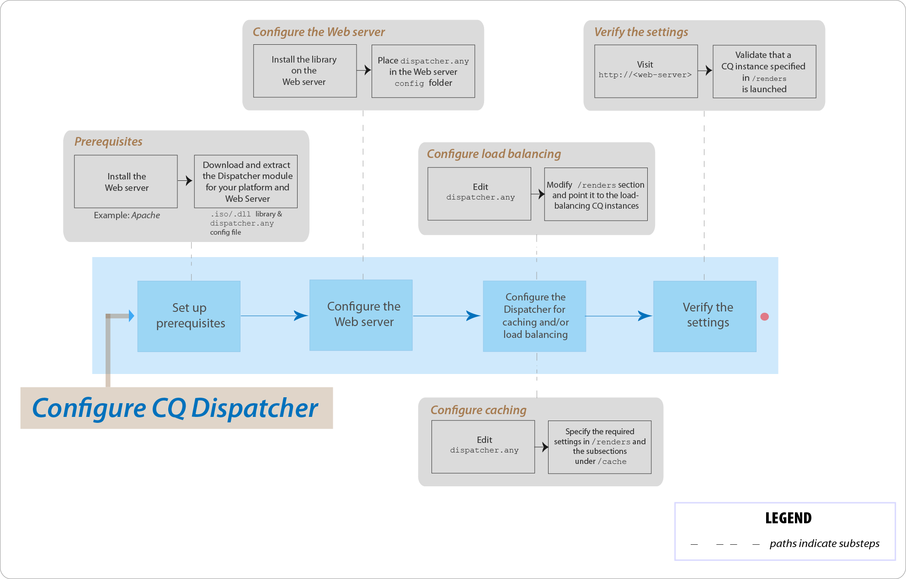

# Veelgestelde vragen over AEM Dispatcher Top



## Inleiding

### Wat is de Dispatcher?

De Dispatcher is ook Adobe Experience Manager in cache plaatsen, of taakverdelingsprogramma&#39;s, of beide, die helpen een snelle en dynamische webontwerpomgeving te realiseren. Voor caching, werkt de Dispatcher als deel van een server van HTTP, zoals Apache. Het heeft als doel om zoveel mogelijk statische website-inhoud op te slaan (of in cache te plaatsen). En de lay-out van de website-engine zo weinig mogelijk openen. In een rol voor taakverdeling verspreidt de Dispatcher gebruikersverzoeken (load) over verschillende AEM-instanties (renders).

Voor caching, gebruikt de module van Dispatcher de capaciteit van de server van het Web om statische inhoud te dienen. De Dispatcher plaatst de in het cachegeheugen opgeslagen documenten in de hoofdmap van het document op de webserver.

### Hoe voert de Dispatcher caching uit?

De Dispatcher gebruikt de mogelijkheid van de webserver om statische inhoud te bedienen. Dispatcher slaat caching documenten bij de documentwortel op de server van het Web op. De Dispatcher beschikt over twee primaire methoden om de cacheinhoud bij te werken wanneer wijzigingen in de website worden aangebracht.

* **Updates van de Inhoud** verwijderen de pagina&#39;s die, en dossiers zijn veranderd die direct met hen worden geassocieerd.
* **auto-Invalidation** maakt automatisch die delen van het geheime voorgeheugen ongeldig die uit datum na een update kunnen zijn. Zo worden relevante pagina&#39;s bijvoorbeeld als verouderd gemarkeerd zonder dat er iets wordt verwijderd.

### Wat zijn de voordelen van taakverdeling?

Bij taakverdeling worden gebruikersaanvragen (load) over verschillende AEM-instanties verdeeld. In de volgende lijst worden de voordelen voor taakverdeling beschreven:

* **Verhoogde verwerkingsmacht**: In praktijk, betekent deze methode dat Dispatcher documentverzoeken tussen verscheidene instanties van AEM deelt. Omdat elke instantie minder documenten te verwerken heeft, hebt u snellere reactietijden. Dispatcher houdt interne statistieken voor elke documentcategorie bij, zodat kan het de lading schatten en de vragen efficiënt verspreiden.
* **Verhoogde mislukken-veilige dekking**: Als Dispatcher geen reacties van een instantie ontvangt, geeft het automatisch verzoeken aan één van de andere instanties terug. Als een instantie dus niet beschikbaar is, is het enige effect een vertraging van de site, in verhouding tot de verloren computerkracht.

>[!NOTE]
>
>Voor verdere details, zie de [&#x200B; pagina van het Overzicht van Dispatcher &#x200B;](dispatcher.md)

## Installeren en configureren

### Waar kan ik de Dispatcher-module downloaden?

U kunt de recentste module van Dispatcher van de [&#x200B; pagina van de Nota&#39;s van de Versie van Dispatcher &#x200B;](release-notes.md) downloaden.

### Hoe installeer ik de Dispatcher-module?

Verwijs naar [&#x200B; het Installeren van Dispatcher &#x200B;](dispatcher-install.md) pagina

### Hoe configureer ik de Dispatcher-module?

Zie [&#x200B; het Vormen Dispatcher &#x200B;](dispatcher-configuration.md) pagina.

### Hoe configureer ik de Dispatcher voor de auteurinstantie?

Zie [&#x200B; Gebruikend Dispatcher met een Instantie van de Auteur &#x200B;](dispatcher.md#using-a-dispatcher-with-an-author-server) voor de gedetailleerde stappen.

### Hoe configureer ik de Dispatcher met meerdere domeinen?

U kunt de CQ Dispatcher configureren met meerdere domeinen, op voorwaarde dat de domeinen aan de volgende voorwaarden voldoen:

* De webinhoud voor beide domeinen wordt opgeslagen in één AEM-opslagplaats
* De bestanden in de Dispatcher-cache kunnen voor elk domein afzonderlijk ongeldig worden gemaakt

Lees [&#x200B; Gebruikend Dispatcher met Veelvoudige Domeinen &#x200B;](dispatcher-domains.md) voor verdere details.

### Hoe vorm ik Dispatcher, zodat alle verzoeken van een gebruiker aan de zelfde Publish instantie worden verpletterd?

U kunt de [&#x200B; kleverige verbindings &#x200B;](dispatcher-configuration.md#identifying-a-sticky-connection-folder-stickyconnectionsfor) eigenschap gebruiken, die ervoor zorgt dat alle documenten voor een gebruiker op de zelfde instantie van AEM worden verwerkt. Deze functie is belangrijk als u persoonlijke pagina&#39;s en sessiegegevens gebruikt. De gegevens worden opgeslagen op de instantie. Daarom moeten de verdere verzoeken van de zelfde gebruiker aan die instantie terugkeren of het gegeven wordt verloren.

Omdat de kleverige verbindingen de capaciteit van Dispatcher beperken om verzoeken te optimaliseren, zou u deze benadering slechts wanneer nodig moeten gebruiken. U kunt de map opgeven die de &quot;plakke&quot; documenten bevat, zodat alle documenten in die map in hetzelfde exemplaar voor een gebruiker worden verwerkt.

### Kan ik kleverige verbindingen en caching in combinatie gebruiken?

Voor de meeste pagina&#39;s die kleverige verbindingen gebruiken, zou u caching moeten uitzetten. Anders wordt hetzelfde exemplaar van de pagina aan alle gebruikers weergegeven, ongeacht de inhoud van de sessie.

Voor sommige toepassingen kan het mogelijk zijn om zowel kleverige verbindingen als caching te gebruiken. Als u bijvoorbeeld een formulier weergeeft waarin gegevens naar een sessie worden geschreven, kunt u naast elkaar kleverige verbindingen gebruiken en in cache plaatsen.

### Kunnen een Dispatcher en een AEM Publish instantie op de zelfde fysieke machine verblijven?

Ja, als de machine voldoende krachtig is. U moet echter de publicatie-instantie Dispatcher en AEM op verschillende computers instellen.

Gewoonlijk bevindt de instantie Publishing zich in de firewall en bevindt de Dispatcher zich in de DMZ. Als u besluit om zowel de instantie Publishing als Dispatcher op dezelfde fysieke computer te plaatsen, moet u ervoor zorgen dat de firewallinstellingen directe toegang tot de instantie Publishing via externe netwerken verbieden.

### Kan ik alleen bestanden met specifieke extensies in cache plaatsen?

Ja. Als u bijvoorbeeld alleen GIF-bestanden in de cache wilt plaatsen, geeft u *.gif op in de cachesectie van het configuratiebestand dispatcher.any.

### Hoe kan ik bestanden uit de cache verwijderen?

U kunt bestanden uit de cache verwijderen met behulp van een HTTP-aanvraag. Wanneer de HTTP-aanvraag wordt ontvangen, verwijdert Dispatcher de bestanden uit de cache. Dispatcher plaatst de bestanden alleen opnieuw in cache wanneer het een clientverzoek voor de pagina ontvangt. Het verwijderen van cachebestanden op deze manier is geschikt voor websites die waarschijnlijk geen gelijktijdige aanvragen voor dezelfde pagina ontvangen.

De HTTP-aanvraag heeft de volgende syntaxis:

```
POST /dispatcher/invalidate.cache HTTP/1.1
CQ-Action: Activate
CQ-Handle: path-pattern
Content-Length: 0
```

Dispatcher verwijdert de in de cache opgeslagen bestanden en mappen met namen die overeenkomen met de waarde van de CQ-Handle-header. Een CQ-handgreep van `/content/geomtrixx-outdoors/en` komt bijvoorbeeld overeen met de volgende items:

Alle bestanden (van een willekeurige bestandsextensie) die en in de map geometrixx-outdoor zijn genoemd.
Elke map met de naam `_jcr_content` onder de map en (die, indien aanwezig, in de cache opgeslagen renderingen van subknooppunten van de pagina bevat).
De map `en` wordt alleen verwijderd als de map `CQ-Action` is `Delete` of `Deactivate` .

Voor verdere details over dit onderwerp, zie [&#x200B; manueel het Valideren van het Geheime voorgeheugen van Dispatcher &#x200B;](page-invalidate.md).

### Hoe implementeer ik toestemming-gevoelige caching?

Zie [&#x200B; Caching Veilige Inhoud &#x200B;](permissions-cache.md) pagina.

### Hoe kan ik communicatie tussen de Dispatcher- en CQ-instanties beveiligen?

Zie [&#x200B; Controlelijst van de Veiligheid van Dispatcher &#x200B;](security-checklist.md) en de [&#x200B; Controlelijst van de Veiligheid van AEM &#x200B;](https://experienceleague.adobe.com/nl/docs/experience-manager-64/administering/security/security-checklist) pagina&#39;s.

### Dispatcher-probleem `jcr:content` gewijzigd in `jcr%3acontent`

**Vraag**: De zaken hebben onlangs een probleem op het niveau van Dispatcher geconfronteerd. Een van de AJAX-oproepen die bepaalde gegevens van de CQ-opslagplaats ophaalde, had er `jcr:content` in. Dat werd gecodeerd naar `jcr%3acontent` , wat resulteerde in die verkeerde resultaatset.

**Antwoord**: Vraag `ResourceResolver.map()` om een vriendschappelijke URL voor GET- verzoeken te produceren en Dispatcher in het voorgeheugen onderbrengende kwesties op te lossen. De methode map() codeert de `:` dubbelepunt naar onderstrepingstekens en de methode resolve() decodeert deze terug naar de leesbare indeling van SLING JCR. Gebruik de methode map() om de URL te genereren die wordt gebruikt in de Ajax-aanroep.

Lees verder: [&#x200B; https://sling.apache.org/documentation/the-sling-engine/mappings-for-resource-resolution.html#namespace-mangling](https://sling.apache.org/documentation/the-sling-engine/mappings-for-resource-resolution.html#namespace-mangling)

## Spoel de Dispatcher

### Hoe configureer ik Dispatcher flush-agents op een Publish-instantie?

Zie de [&#x200B; pagina van de Replicatie &#x200B;](https://experienceleague.adobe.com/nl/docs/experience-manager-65/content/implementing/deploying/configuring/replication#configuring-your-replication-agents).

### Hoe los ik problemen met het flushing in Dispatcher op?

[&#x200B; zie deze het oplossen van problemenartikelen &#x200B;](https://experienceleague.adobe.com/search.html?lang=nl-NL#q=troubleshooting%20dispatcher%20flushing%20issues&sort=relevancy&f:el_product=[Experience%20Manager]).

Als de verrichtingen van de Schrapping de Dispatcher veroorzaken om te spoelen, [&#x200B; gebruiken de tijdelijke oplossing in deze communautaire blogpost door Sensei Martin &#x200B;](https://mkalugin-cq.blogspot.com/2012/04/i-have-been-working-on-following.html).

### Hoe kan ik DAM-middelen uit de Dispatcher-cache verwijderen?

U kunt de functie voor ketenreplicatie gebruiken. Als deze functie is ingeschakeld, verzendt de Dispatcher-instantie flush een aanvraag voor uitspoelen wanneer een replicatie wordt ontvangen van de Author-instantie.

U schakelt dit als volgt in:

1. [&#x200B; volg hier de stappen &#x200B;](page-invalidate.md#invalidating-dispatcher-cache-from-a-publishing-instance) om het spoelen agenten bij te creëren publiceren
1. Ga naar de configuratie van elke agent.
1. Op het **Trekkers** lusje, controleer **op ontvangen** doos.

## Overige

Hoe bepaalt de Dispatcher of een document up-to-date is?
Om te bepalen of een document bijgewerkt is, voert de Dispatcher de volgende handelingen uit:

Hiermee wordt gecontroleerd of het document automatisch wordt ongeldig gemaakt. Als dat niet het geval is, wordt het document als bijgewerkt beschouwd.
Als het document is geconfigureerd voor automatische validatie, controleert de Dispatcher of het ouder of nieuwer is dan de laatste beschikbare wijziging. Als het ouder is, vraagt de Dispatcher de huidige versie van de instantie van AEM en vervangt de versie in het geheime voorgeheugen.

### Hoe retourneert de Dispatcher documenten?

U kunt bepalen of Dispatcher een document in cache plaatst door het [&#x200B; de configuratiedossier van Dispatcher &#x200B;](dispatcher-configuration.md) te gebruiken, `dispatcher.any`. De Dispatcher controleert het verzoek aan de lijst van cacheable documenten. Als het document niet in deze lijst staat, vraagt de Dispatcher het document aan bij het AEM-exemplaar.

De eigenschap `/rules` bepaalt welke documenten in de cache worden geplaatst op basis van het documentpad. Ongeacht de eigenschap `/rules` plaatst Dispatcher een document nooit in cache in de volgende omstandigheden:

* De aanvraag-URI bevat een `(?)` vraagteken.
* Het geeft een dynamische pagina aan, zoals een zoekresultaat dat niet in de cache hoeft te worden opgeslagen.
* De bestandsextensie ontbreekt.
* De webserver heeft de extensie nodig om het documenttype (het MIME-type) te bepalen.
* De verificatieheader wordt ingesteld (configureerbaar).
* Als de AEM-instantie reageert met de volgende headers:
   * geen cache
   * no-store
   * moet opnieuw valideren

De Dispatcher slaat cachebestanden op de webserver op alsof ze deel uitmaken van een statische website. Als een gebruiker een document in de cache opvraagt, controleert de Dispatcher of het document bestaat in het bestandssysteem van de webserver. Als dat het geval is, retourneert de Dispatcher de documenten. Als dat niet het geval is, vraagt de Dispatcher het document aan bij het AEM-exemplaar.

>[!NOTE]
>
>De methoden GET of HEAD (voor de HTTP-header) kunnen door de Dispatcher in cache worden geplaatst. Voor extra informatie over reactiekopbal caching, zie de [&#x200B; Caching sectie van de Kopballen van de Reactie van HTTP &#x200B;](dispatcher-configuration.md#caching-http-response-headers).

### Kan ik veelvoudige Dispatchers in een opstelling uitvoeren?

Ja. In dergelijke gevallen moet u ervoor zorgen dat de Dispatchers beide rechtstreeks toegang hebben tot de AEM-website. Een Dispatcher kan geen verzoeken van een andere Dispatcher verwerken.
