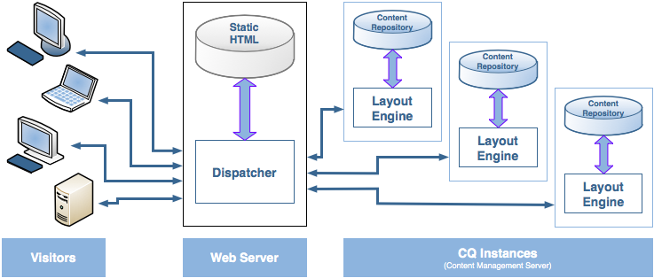

# Dispatcher-overzicht {#dispatcher-overview}

>[!NOTE]
>
>Dispatcher-versies zijn onafhankelijk van AEM (Adobe Experience Manager). U bent mogelijk omgeleid naar deze pagina als u een koppeling naar de documentatie van Dispatcher hebt gevolgd. Die koppeling is ingesloten in de documentatie voor een vorige versie van AEM.

Dispatcher is een Adobe Experience Manager-programma voor caching en taakverdeling dat wordt gebruikt met een webserver op bedrijfsniveau.

Het implementatieproces van de Dispatcher is onafhankelijk van de webserver en het gekozen besturingssysteem:

1. Meer informatie over Dispatcher (deze pagina). Ook, zie [&#x200B; vaak gestelde vragen over Dispatcher &#x200B;](/help/using/dispatcher-faq.md).
1. Installeer a [&#x200B; gesteunde Webserver &#x200B;](https://experienceleague.adobe.com/nl/docs/experience-manager-65/content/implementing/deploying/introduction/technical-requirements) volgens de documentatie van de Webserver.
1. [&#x200B; installeer de module van Dispatcher &#x200B;](dispatcher-install.md) op uw Webserver en vorm dienovereenkomstig de Webserver.
1. [&#x200B; vorm Dispatcher &#x200B;](dispatcher-configuration.md) (het dispatcher.om het even welk dossier).
1. [&#x200B; vorm AEM &#x200B;](page-invalidate.md) zodat de inhoudsupdates het geheime voorgeheugen ongeldig maken.

>[!NOTE]
>
>Een beter inzicht krijgen in de werking van de Dispatcher met AEM:
>
>* Zie [&#x200B; de Communautaire Deskundigen van AEM voor Juli 2017 vragen &#x200B;](https://communities.adobeconnect.com/pf0gem7igw1f/).
>* Heb toegang tot [&#x200B; deze bewaarplaats &#x200B;](https://github.com/adobe/aem-dispatcher-experiments). Het bevat een verzameling experimenten in een &quot;home&quot;-laboratoriumformaat.


Gebruik de volgende informatie zoals vereist:

* [De Dispatcher-beveiligingscontrolelijst](security-checklist.md)
<!-- URL is 404! * [The Dispatcher Knowledge Base](https://helpx.adobe.com/experience-manager/kb/index/dispatcher.html) -->
* [&#x200B; Optimizing een Website voor de Prestaties van het Geheime voorgeheugen &#x200B;](https://experienceleague.adobe.com/nl/docs/experience-manager-65/content/implementing/deploying/configuring/configuring-performance)
* [Dispatcher met meerdere domeinen gebruiken](dispatcher-domains.md)
* [SSL gebruiken met Dispatcher](dispatcher-ssl.md)
* [Het uitvoeren van Toestemming-Gevoelige Caching](permissions-cache.md)
* [Problemen met Dispatcher oplossen](dispatcher-troubleshooting.md)
* [Veelgestelde vragen over Dispatcher Top Issues](dispatcher-faq.md)

>[!NOTE]
>
>**het gemeenschappelijkste gebruik van Dispatcher** moet reacties van een AEM **publiceren instantie** in het voorgeheugen onderbrengen, om de ontvankelijkheid en de veiligheid van uw extern onder ogen ziende gepubliceerde website te verhogen. Het grootste deel van de discussie gaat over deze zaak.
>
>Maar, kan Dispatcher ook worden gebruikt om de ontvankelijkheid van uw **auteursinstantie** te verhogen. Dit is waar, vooral als u een groot aantal gebruikers hebt die uw website uitgeven en bijwerken. Voor details specifiek voor dit geval zie [&#x200B; Gebruikend een Dispatcher met een Server van de Auteur &#x200B;](#using-a-dispatcher-with-an-author-server), hieronder.

## Waarom Dispatcher gebruiken om caching uit te voeren? {#why-use-dispatcher-to-implement-caching}

Er zijn twee basisbenaderingen voor webpublicatie:

* **de Statische Servers van het Web**: zoals Apache of IIS, zijn eenvoudig, maar snel.
* **Servers van het Beheer van de Inhoud**: die dynamische, in real time, intelligente inhoud verstrekken, maar meer computertijd en andere middelen vereisen.

De Dispatcher helpt een snelle en dynamische omgeving te realiseren. Het werkt als deel van een statische server van HTML, zoals Apache, met als doel:

* het opslaan (of &quot;in cache plaatsen&quot;) van zoveel mogelijk site-inhoud, in de vorm van een statische website
* zo weinig mogelijk toegang krijgen tot de layout-engine.

Dit betekent dat:

* **statische inhoud** wordt behandeld met de zelfde snelheid en het gemak zoals op een statische Webserver. U kunt ook de beheer- en beveiligingsprogramma&#39;s gebruiken die beschikbaar zijn voor uw statische webservers.

* **dynamische inhoud** wordt geproduceerd zoals nodig, zonder het systeem neer te vertragen meer dan absoluut noodzakelijk.

De Dispatcher bevat mechanismen voor het genereren en bijwerken van statische HTML op basis van de inhoud van de dynamische site. U kunt in detail specificeren welke documenten als statische dossiers worden opgeslagen en die altijd dynamisch worden geproduceerd.

In dit gedeelte worden de beginselen van dit proces toegelicht.

### Statische webserver {#static-web-server}


Een statische webserver, zoals Apache of IIS, levert statische HTML-bestanden aan bezoekers van uw website. Statische pagina&#39;s worden één keer gemaakt, zodat voor elke aanvraag dezelfde inhoud wordt geleverd.

Dit proces is eenvoudig en efficiënt. Als een bezoeker een bestand zoals een HTML-pagina aanvraagt, wordt het bestand rechtstreeks uit het geheugen genomen. In het slechtste geval wordt het bestand vanaf het lokale station gelezen. Statische webservers zijn al geruime tijd beschikbaar. Er is dus een breed scala aan instrumenten voor beheer en beveiliging. Deze hulpmiddelen zijn goed geïntegreerd met netwerkinfrastructuur.

### Servers voor inhoudsbeheer {#content-management-servers}


Als u een CMS (Content Management Server) gebruikt, zoals AEM, verwerkt een geavanceerde lay-outengine de aanvraag van een bezoeker. De engine leest inhoud uit een opslagplaats die, in combinatie met stijlen, indelingen en toegangsrechten, de inhoud omzet in een document dat is aangepast aan de behoeften en rechten van de bezoeker.

Met deze workflow kunt u rijkere, dynamische inhoud maken die de flexibiliteit en functionaliteit van uw website vergroot. Voor de lay-outengine is echter meer verwerkingskracht nodig dan voor een statische server. Hierdoor kan deze installatie trager worden als veel bezoekers het systeem gebruiken.

## Hoe Dispatcher caching uitvoert {#how-dispatcher-performs-caching}


**de Folder van het Geheime voorgeheugen** voor caching, gebruikt de module van Dispatcher de capaciteit van de Webserver om statische inhoud te dienen. Dispatcher plaatst de caching documenten in de wortel van de server van het Web.

>[!NOTE]
>
>Wanneer de configuratie voor HTTP-koptekstcache ontbreekt, slaat de Dispatcher alleen de HTML-code van de pagina op - de HTTP-headers worden niet opgeslagen. Dit scenario kan een probleem zijn als u verschillende coderingen binnen uw website gebruikt, omdat deze pagina&#39;s mogelijk verloren gaan. Om HTTP toe te laten Kopbal Caching, zie [&#x200B; Vormend het Geheime voorgeheugen van Dispatcher.](https://experienceleague.adobe.com/nl/docs/experience-manager-dispatcher/using/configuring/dispatcher-configuration)

>[!NOTE]
>
>Als u de hoofdmap van het document van uw webserver zoekt op NAS (Network-Attached Storage), neemt de prestaties af. Ook, wanneer een documentwortel op NAS tussen veelvoudige Webservers wordt gedeeld, kunnen de intermitterende sloten voorkomen wanneer de replicatieacties worden uitgevoerd.

>[!NOTE]
>
>In de Dispatcher wordt het cachedocument opgeslagen in een structuur die gelijk is aan de aangevraagde URL.
>
>Er kunnen beperkingen op besturingssysteemniveau gelden voor de lengte van de bestandsnaam. Dat wil zeggen, als u een URL hebt met een groot aantal kiezers.

### Methoden voor het in cache plaatsen

De Dispatcher beschikt over twee primaire methoden om de cacheinhoud bij te werken wanneer wijzigingen in de website worden aangebracht.

* **Updates van de Inhoud** verwijderen de pagina&#39;s die, en dossiers zijn veranderd die direct met hen worden geassocieerd.
* **auto-Invalidation** maakt automatisch die delen van het geheime voorgeheugen ongeldig die uit datum na een update kunnen zijn. Dat wil zeggen dat relevante pagina&#39;s in feite verouderd zijn, zonder iets te verwijderen.

### Inhoud bijwerken

In een inhoudsupdate veranderen een of meer AEM-documenten. AEM verzendt een synchronisatieverzoek naar de Dispatcher, die de cache dienovereenkomstig bijwerkt:

1. De gewijzigde bestanden worden uit de cache verwijderd.
1. Alle bestanden die met dezelfde greep beginnen, worden uit de cache verwijderd. Als het bestand `/en/index.html` bijvoorbeeld wordt bijgewerkt, worden alle bestanden verwijderd die beginnen met `/en/index.` . Met dit mechanisme kunt u cacheefficiënte sites ontwerpen, met name voor beeldnavigatie.
1. Het *raakt* het zogenaamde **statfile**, die timestamp van het staatsdossier bijwerkt om op de datum van de laatste verandering te wijzen.

Er zij op gewezen dat:

* De Updates van de inhoud worden typisch gebruikt met een auteurssysteem dat &quot;weet&quot;wat moet worden vervangen.
* Bestanden die worden beïnvloed door een update van de inhoud, worden verwijderd, maar niet onmiddellijk vervangen. De volgende keer dat een dergelijk bestand wordt aangevraagd, haalt de Dispatcher het nieuwe bestand op van de AEM-instantie en plaatst het bestand in de cache, waardoor de oude inhoud wordt overschreven.
* Gewoonlijk worden automatisch gegenereerde afbeeldingen die tekst van een pagina bevatten, opgeslagen in afbeeldingsbestanden die beginnen met dezelfde greep, zodat de koppeling bestaat voor verwijdering. U kunt bijvoorbeeld de titeltekst van de pagina mypage.html opslaan als de afbeelding mypage.titlePicture.gif in dezelfde map. Op deze manier wordt de afbeelding automatisch uit de cache verwijderd telkens wanneer de pagina wordt bijgewerkt, zodat u zeker weet dat de afbeelding altijd de huidige versie van de pagina weerspiegelt.
* U hebt mogelijk meerdere statfiles, bijvoorbeeld één per taalmap. Als een pagina wordt bijgewerkt, zoekt AEM naar de volgende ouderomslag die een statfile bevatten, en *raakt* dat dossier.

### Automatische ongeldigmaking

De auto-ongeldigverklaring maakt automatisch delen van het geheime voorgeheugen ongeldig - zonder fysieke het schrappen van om het even welke dossiers. Bij elke update van de inhoud wordt het zogenaamde statfile aangeraakt, zodat het tijdstempel de laatste update van de inhoud weergeeft.

De Dispatcher heeft een lijst met bestanden die automatisch worden geannuleerd. Wanneer een document uit die lijst wordt gevraagd, vergelijkt de Dispatcher de datum van het cachedocument met de tijdstempel van het statusbestand:

* als het document in de cache nieuwer is, retourneert de Dispatcher het.
* Als deze ouder is, haalt de Dispatcher de huidige versie op uit het AEM-exemplaar.

Ook hier moeten enkele punten worden vermeld:

* Automatische ongeldigmaking wordt doorgaans gebruikt wanneer de onderlinge relaties complex zijn, zoals HTML-pagina&#39;s. Deze pagina&#39;s bevatten koppelingen en navigatie-items, zodat deze gewoonlijk moeten worden bijgewerkt nadat de inhoud is bijgewerkt. Als u automatisch PDF- of afbeeldingsbestanden hebt gegenereerd, kunt u ervoor kiezen deze bestanden ook automatisch ongeldig te maken.
* De automatische ongeldigverklaring impliceert geen actie door de Dispatcher bij updatetijd, behalve voor het aanraken van het statfile. Als u het bestand aanraakt, wordt de cacheinhoud echter automatisch verouderd, zonder dat de inhoud fysiek uit de cache wordt verwijderd.

## Hoe Dispatcher documenten retourneert {#how-dispatcher-returns-documents}


### Bepalen of een document in cache moet worden geplaatst

U kunt [&#x200B; bepalen welke documenten de geheime voorgeheugens van Dispatcher in het configuratiedossier &#x200B;](https://experienceleague.adobe.com/nl/docs/experience-manager-dispatcher/using/configuring/dispatcher-configuration). De Dispatcher controleert het verzoek aan de lijst van cacheable documenten. Als het document niet in deze lijst staat, vraagt de Dispatcher het document aan bij het AEM-exemplaar.

In de volgende gevallen vraagt de Dispatcher het document altijd rechtstreeks bij het AEM-exemplaar:

* De aanvraag-URI bevat een vraagteken `?` . Dit scenario geeft meestal een dynamische pagina aan, zoals een zoekresultaat, dat niet in de cache hoeft te worden opgeslagen.
* De bestandsextensie ontbreekt. De webserver heeft de extensie nodig om het documenttype (het MIME-type) te bepalen.
* De verificatieheader wordt ingesteld (configureerbaar).

>[!NOTE]
>
>De methoden GET of HEAD (voor de HTTP-header) kunnen door de Dispatcher in cache worden geplaatst. Voor extra informatie over reactiekopbal caching, zie de [&#x200B; Caching sectie van de Kopballen van de Reactie van HTTP &#x200B;](https://experienceleague.adobe.com/nl/docs/experience-manager-dispatcher/using/configuring/dispatcher-configuration).

### Bepalen of een document in de cache is geplaatst

De Dispatcher slaat de cachebestanden op de webserver op alsof ze deel uitmaken van een statische website. Als een gebruiker om een cacheable document verzoekt, controleert de Dispatcher of dat document in het dossiersysteem van de Webserver bestaat:

* als het document in de cache is opgeslagen, retourneert Dispatcher het bestand.
* als het niet in de cache is opgeslagen, vraagt de Dispatcher het document aan bij het AEM-exemplaar.

### Bepalen of een document bijgewerkt is

Als u wilt weten of een document up-to-date is, voert de Dispatcher twee stappen uit:

1. Hiermee wordt gecontroleerd of het document automatisch wordt ongeldig gemaakt. Als dat niet het geval is, wordt het document als bijgewerkt beschouwd.
1. Als het document is geconfigureerd voor automatische validatie, controleert de Dispatcher of het ouder of nieuwer is dan de laatste beschikbare wijziging. Als het ouder is, vraagt de Dispatcher de huidige versie van de instantie van AEM en vervangt de versie in het geheime voorgeheugen.

>[!NOTE]
>
>Documenten zonder **auto-ongeldigverklaring** blijven in het geheime voorgeheugen tot zij fysisch worden geschrapt. Bijvoorbeeld door een inhoudsupdate op de website.

## Voordelen van taakverdeling {#the-benefits-of-load-balancing}

Load Balancing is de manier waarop de computerbelasting van de website over verschillende instanties van AEM wordt verdeeld.



U wint:

* **verhoogde verwerkingsmacht**
In de praktijk betekent een verhoogde verwerkingscapaciteit dat de Dispatcher verzoeken om documenten deelt tussen verschillende exemplaren van AEM. Omdat elk exemplaar nu minder documenten te verwerken heeft, hebt u snellere reactietijden. Dispatcher houdt interne statistieken voor elke documentcategorie bij, zodat kan het de lading schatten en de vragen efficiënt verspreiden.

* **verhoogde mislukken-veilige dekking**
Als de Dispatcher geen reacties van een instantie ontvangt, worden aanvragen automatisch doorgestuurd naar een van de andere instanties. Als een instantie niet beschikbaar wordt, is het enige effect een vertraging van de plaats, evenredig aan de verloren computermacht. Alle services gaan echter door.

* U kunt ook verschillende websites beheren op dezelfde statische webserver.

>[!NOTE]
>
>Terwijl de taakverdeling de belasting efficiënt spreidt, helpt het in cache plaatsen om de belasting te verminderen. Probeer caching daarom te optimaliseren en de totale belasting te verminderen voordat u uploadbalancing instelt. Een goede caching kan de prestaties van het taakverdelingsmechanisme verhogen of het in evenwicht brengen van de belasting onnodig maken.

>[!CAUTION]
>
>Eén Dispatcher kan weliswaar de capaciteit van de beschikbare publicatie-instanties verzadigen, maar voor sommige zeldzame toepassingen kan het ook zinvol zijn de belasting te verdelen tussen twee Dispatcher-instanties. Configuraties met meerdere verzenders moeten zorgvuldig worden overwogen. De reden hiervoor is dat een extra Dispatcher de belasting van de beschikbare publicatie-exemplaren kan verhogen en de prestaties in de meeste toepassingen gemakkelijk kan verlagen.

## Hoe de Dispatcher taakverdeling uitvoert {#how-the-dispatcher-performs-load-balancing}

### Prestatiestatistieken

De Dispatcher houdt interne statistieken bij over hoe snel elke instantie van AEM documenten verwerkt. Op basis van deze gegevens schat de Dispatcher welke instantie de snelste responstijd kan leveren bij het beantwoorden van een verzoek. De benodigde berekeningstijd wordt dus op die instantie gereserveerd.

Verschillende typen aanvragen kunnen verschillende gemiddelde voltooiingstijden hebben, zodat u met de Dispatcher documentcategorieën kunt opgeven. Deze categorieën worden dan in overweging genomen bij het berekenen van de tijdschattingen. U kunt bijvoorbeeld onderscheid maken tussen HTML-pagina&#39;s en -afbeeldingen, omdat de standaardresponstijden sterk kunnen verschillen.

Als u een uitgebreide zoekfunctie gebruikt, kunt u een categorie voor zoekopdrachten maken. Met deze methode kan de Dispatcher zoekopdrachten verzenden naar de instantie die het snelst reageert. Het helpt ook voorkomen dat een langzamere instantie wordt gestort wanneer deze meerdere ‘dure’ zoekopdrachten ontvangt, terwijl de andere de ‘goedkopere’ aanvragen krijgen.

### Persoonlijke inhoud (Vaste verbindingen)

Vaste verbindingen zorgen ervoor dat documenten voor één gebruiker allemaal op dezelfde instantie van AEM zijn samengesteld. Dit punt is belangrijk als u gepersonaliseerde pagina&#39;s en zittingsgegevens gebruikt. De gegevens worden opgeslagen op de instantie, zodat de verdere verzoeken van de zelfde gebruiker aan die instantie moeten terugkeren of het gegeven wordt verloren.

Omdat kleverige verbindingen de mogelijkheid van Dispatcher om de verzoeken te optimaliseren beperken, zou u hen slechts moeten gebruiken wanneer nodig. U kunt de map opgeven die de &quot;plakke&quot; documenten bevat, zodat alle documenten in die map in dezelfde instantie voor elke gebruiker worden samengesteld.

>[!NOTE]
>
>Voor de meeste pagina&#39;s die kleverige verbindingen gebruiken, moet u caching uitschakelen - anders ziet de pagina het zelfde aan alle gebruikers, ongeacht de zittingsinhoud.
>
>Voor a *weinig* toepassingen, kan het mogelijk zijn om zowel kleverige verbindingen als caching te gebruiken; bijvoorbeeld, als u een vorm toont die gegevens aan de zitting schrijft.

## Meerdere verzenders gebruiken {#using-multiple-dispatchers}

In complexe instellingen kunt u meerdere verzenders gebruiken. U kunt bijvoorbeeld het volgende gebruiken:

* één Dispatcher om een website op het Intranet te publiceren
* een tweede Dispatcher, onder een ander adres en met verschillende beveiligingsinstellingen, om dezelfde inhoud op internet te publiceren.

In dat geval moet u ervoor zorgen dat elke aanvraag slechts door één Dispatcher wordt behandeld. Een Dispatcher behandelt geen verzoeken die afkomstig zijn van een andere Dispatcher. Zorg er daarom voor dat beide verzenders de AEM-website rechtstreeks openen.

## Dispatcher gebruiken met een CDN {#using-dispatcher-with-a-cdn}

Een CDN (Content Delivery Network), zoals Akamai Edge Delivery of Amazon Cloud Front, levert inhoud op een locatie die dicht bij de eindgebruiker ligt. Door

* zorgt voor snellere responstijden voor eindgebruikers
* start het laden van uw servers

Als een HTTP-infrastructuurcomponent werkt een CDN ongeveer als een Dispatcher. Wanneer een knoop CDN een verzoek ontvangt, dient het het verzoek van zijn geheime voorgeheugen, indien mogelijk (het middel is beschikbaar in het geheime voorgeheugen en is geldig). Anders, bereikt het uit aan de volgende dichtstbijzijnde server om het middel terug te winnen en het voor verdere verzoeken in het voorgeheugen onder te brengen indien aangewezen.

De &quot;eerstvolgende dichtstbijzijnde server&quot; is afhankelijk van uw specifieke installatie. In een Akamai-configuratie kan het verzoek bijvoorbeeld het volgende pad volgen:

* De Akamai Edge-node
* De Midgress-laag van Akamai
* Uw firewall
* Uw taakverdelingsmechanisme
* Dispatcher
* AEM

Doorgaans is Dispatcher de volgende server die het document kan aanleveren vanuit een cache en die invloed heeft op de antwoordheaders die worden geretourneerd naar de CDN-server.

## Een CDN-cache beheren {#controlling-a-cdn-cache}

Er zijn verschillende manieren om te bepalen hoe lang een CDN een bron in cache plaatst voordat deze vanuit Dispatcher wordt opgehaald.

1. Expliciete configuratie.
Vorm hoe lang de bijzondere middelen in het geheime voorgeheugen van CDN, afhankelijk van mime type, uitbreiding, verzoektype, etc. worden gehouden.

1. Verlopen- en cachebeheerkoppen.
De meeste CDN&#39;s respecteren `Expires:` en `Cache-Control:` HTTP-headers als deze worden verzonden door de upstream-server. Deze methode kan, bijvoorbeeld, worden bereikt door [&#x200B; te gebruiken mod_validate &#x200B;](https://httpd.apache.org/docs/2.4/mod/mod_expires.html) Module Apache.

1. Handmatige validatie.
CDNs staat middelen toe om uit het geheime voorgeheugen door Webinterfaces worden verwijderd.
1. Op API gebaseerde validatie.\
   De meeste CDN&#39;s beschikken ook over een REST- en/of SOAP-API waarmee bronnen uit de cache kunnen worden verwijderd.

In een standaard AEM-configuratie biedt de configuratie door middel van extensies, paden of beide - hetgeen kan worden bereikt met bovenstaande punten 1 en 2 - mogelijkheden om redelijke cacheperioden in te stellen. Deze cacheperioden gelden voor vaak gebruikte bronnen die niet vaak worden gewijzigd, zoals ontwerpafbeeldingen en clientbibliotheken. Wanneer de nieuwe versies worden opgesteld, typisch wordt een handongeldigverklaring vereist.

Als deze benadering wordt gebruikt om beheerde inhoud in het voorgeheugen onder te brengen, impliceert het dat de inhoudsveranderingen slechts aan eind - gebruikers zichtbaar zijn zodra de gevormde caching periode is verlopen. En wanneer het document weer van Dispatcher wordt opgehaald.

Voor fijnere besturing kunt u met API-gebaseerde validatie de cache van een CDN ongeldig maken als de Dispatcher-cache ongeldig wordt gemaakt. Gebaseerd op CDNs API, kunt u uw eigen [&#x200B; ContentBuilder &#x200B;](https://developer.adobe.com/experience-manager/reference-materials/6-5/javadoc/com/day/cq/replication/ContentBuilder.html) en [&#x200B; TransportHandler &#x200B;](https://developer.adobe.com/experience-manager/reference-materials/6-5/javadoc/com/day/cq/replication/TransportHandler.html) (als API niet op REST-Gebaseerd is) uitvoeren, en opstelling een Agent van de Replicatie die deze stukken gebruikt om het geheime voorgeheugen van CDN ongeldig te maken.

>[!NOTE]
>
>Zie ook [&#x200B; de Veiligheid van AEM (CQ) Dispatcher en CDN+Browser Caching &#x200B;](https://www.slideshare.net/andrewmkhoury/dispatcher-caching-aemgemspart2jan2015) en geregistreerde presentatie op [&#x200B; Dispatcher Caching &#x200B;](https://experienceleague.adobe.com/nl/docs/events/experience-manager-gems-recordings/gems2015/aem-dispatcher-caching-new-features-and-optimizations).

## Dispatcher gebruiken met een Auteur-server {#using-a-dispatcher-with-an-author-server}

>[!CAUTION]
>
>Als u [&#x200B; AEM met Aanraakinterface &#x200B;](https://experienceleague.adobe.com/nl/docs/experience-manager-65/content/implementing/developing/introduction/touch-ui-concepts) gebruikt, **niet** inhoud van de geheim voorgeheugenauteursinstantie. Als caching voor de auteursinstantie wordt toegelaten, moet u het onbruikbaar maken en de inhoud van de geheim voorgeheugenfolder schrappen. Als u caching wilt uitschakelen, bewerkt u het `author_dispatcher.any` -bestand en wijzigt u de eigenschap `/rule` van de sectie `/cache` als volgt:

```xml
/rules
{
/0000
{ /type "deny" /glob "*"}
}
```

Een Dispatcher kan vóór een auteurinstantie worden gebruikt om auteursprestaties te verbeteren. Ga als volgt te werk om een ontwerpversie van Dispatcher te configureren:

1. Installeer een Dispatcher in een Webserver (een Apache of IIS Webserver, zie [&#x200B; Installerend Dispatcher &#x200B;](dispatcher-install.md)).
1. Test de nieuw geïnstalleerde Dispatcher op een werkende AEM-publicatie-instantie. Zo weet u zeker dat een correcte installatie op de basislijn is uitgevoerd.
1. Zorg ervoor dat de Dispatcher via TCP/IP verbinding kan maken met de auteurinstantie.
1. Vervang het steekproef `dispatcher.any` dossier met het `author_dispatcher.any` dossier dat van de [&#x200B; download van Dispatcher &#x200B;](release-notes.md#downloads) wordt voorzien.
1. Open `author_dispatcher.any` in een teksteditor en breng de volgende wijzigingen aan:

   1. Wijzig de sectie `/hostname` en `/port` van de sectie `/renders` zodat ze naar de instantie van de auteur verwijzen.
   1. Wijzig de `/docroot` van de `/cache` -sectie zodat deze naar een cachemap verwijzen. In het geval dat u [&#x200B; AEM met Aanraakinterface &#x200B;](https://experienceleague.adobe.com/nl/docs/experience-manager-65/content/implementing/developing/introduction/touch-ui-concepts) gebruikt, zie hierboven de waarschuwing.
   1. Sla de wijzigingen op.

1. Verwijder alle bestaande bestanden in de map `/cache` > `/docroot` die u hierboven hebt geconfigureerd.
1. Start de webserver opnieuw.

>[!NOTE]
>
>Wanneer u met de meegeleverde `author_dispatcher.any` -configuratie een pakket met CQ5-functies, hotfix of toepassingscode installeert dat invloed heeft op inhoud onder `/libs` of `/apps` , moet u de bestanden in de cache verwijderen. De bestanden staan onder deze mappen in de cache van Dispatcher. Dit zorgt ervoor dat de volgende keer dat ze worden opgevraagd, de nieuw bijgewerkte bestanden worden opgehaald en niet de oude in de cache opgeslagen bestanden.

>[!CAUTION]
>
>Als u de eerder gevormde auteur Dispatcher hebt gebruikt en a *Dispatcher die agent* toeliet, doe het volgende:

1. Schrap of maak de **auteur Dispatcher** onbruikbaar flushing agent op uw de auteursinstantie van AEM.
1. Opnieuw de configuratie van de auteurDispatcher door de nieuwe instructies hierboven te volgen.

<!--
[Author Dispatcher configuration file (Dispatcher 4.1.2 or later)](assets/author_dispatchernew.any)
-->
<!--[!NOTE]
>
>A related knowledge base article can be found here:  
>[How to configure the dispatcher in front of an authoring environment](https://helpx.adobe.com/cq/kb/HowToConfigureDispatcherForAuthoringEnvironment.html)
-->
